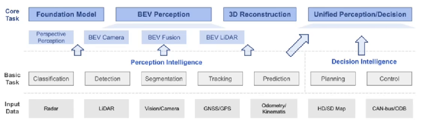

# BEV感知算法的概念

## 什么是BEV？

- Bird’s-Eye-View,鸟瞰图（俯视图）；
  
- 尺寸变化小：在BEV视角下尺寸相对一致；

- 遮挡小：不受遮挡的影响；

## 什么是感知？

- 是一种响应模式，比如人脑对外界的响应；

## 什么是算法？

- 一种数学模型；
- 帮助计算机理解不同的输入，从而实现不同任务。
  
## BEV感知

- BEV感知是一个建立在众多子任务上的一种概念
- 包括：分类、检测、分割等等
- BEV感知输入：包括毫米波雷达、激光雷达点云、相机图像等等；依照输入的不同感知算法有进一步的划分。综合如下图所示：

