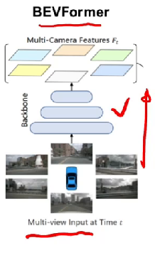
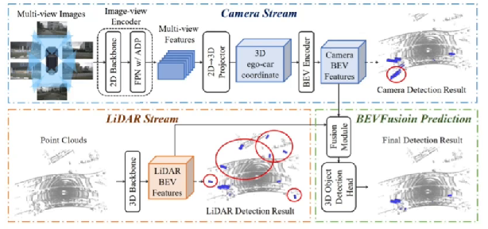

# BEV感知算法的数据形式

## 什么是图像？

- 图像是由相机生成的，是将三维世界中的坐标点（m）映射到二维图像平面（pix）；
- 图像的优势在于：纹理丰富、成本低；
- 基于图像的任务、基础模型相对成熟和完善，比较容易扩展到BEV感知算法中。

## 处理图像数据的网络

BEVFormer

BEVFusion

## 什么是点云？

- 点云的基本组成单元是点，点组成的集合叫点云；
- 点云特点：稀疏性、无序性、是一种3D表征；
- 点云可以用三维坐标来进行表示（x,y,z）

