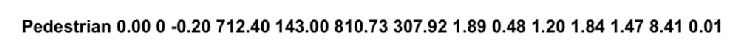

# BEV感知算法数据集

## KITTI数据集

KITTI数据集官网：

在标注文件中一般数据形式如下所示：

- 第一个数据0.00表示数据是否被截断，用[0,1]之间进行表示；
- 第二个数据表示物体是否被遮挡，离散值 1（没有），2（遮挡严重），3（不清楚）；
- 第三个表示弧度值，当前物体与相机之间的夹角；
- 第四、五表示标注框左上角的值，第六七表示右下角的标注框的位置；
- 第八 九 十表示高、宽 、长
- 第十一 十二 十三表示3d框中心
- 第十四表示置信度

## nuScenes数据集

- nuScences数据规模为：140万个相机图像、39万个激光雷达扫描结果、140万个毫米波雷达扫描结果。
- 目标类别包括：23类
- 约140万个标注对象