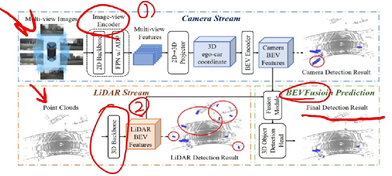

# BEV感知分类
## BEV LIDAR

### BEV LIDAR的通用模式

- Pre-BEV Feature Extraction ：先提取特征，再生成BEV表征，代表性的算法有PV-RCNN等
- Post-BEV Feature Extraction：先转换到BEV视图，提取特征，代表性的算法PointPillar等

### BEV Camera的通用形式

- 主要包括2D特征提取模块、视角转换模块、和3Ddecoder检测模块

- 其中shared 2D Feature Extractor：表示输入多张图像共用一个网络
- 视角转换 ViewTransformation 2D-3D 视角转换主要将2D转换为3D视角
- 检测模块         

#### BEVFormer主题模块

- 输入--->输出
- BackBone、Encoder（Spatial and Temporal）、decoder

### BEV Fusion

- BEV Fusion算法的设计，离不开BEV LIDAR和BEV Camera算法
- BEV Fusion算法的设计，通常是使用一个fusion模块进行点云和图像特征的融合。

