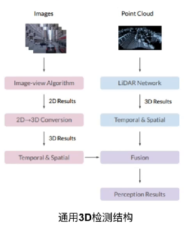
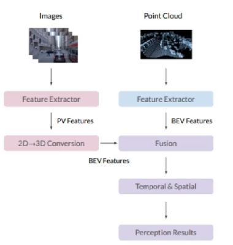

# BEV感知算法的优劣

## 通用3D检测结构与BEV感知算法结构

两者的功能是一致的，两种方法的主要区别通用3D检测利用图像可以识别出结果，利用激光点云也可以识别出结果，可以对二者的识别结果进行融合得到最终的结果。BEV算法结构首先将图像数据和点云数据进行特征提取，将2D图像转换到3D图像下，与点云图像进行一个融合，这种融合一般是BEV fusion 的融合，然后加上一些时间和空间上的处理然后得到最终的结果。

## BEV感知算法的优劣

学术研究意义：

- 有利于探讨2D到3D的转换过程；
- 有利于利用视觉图像识别远距离物体或者颜色引导的道路

工业应用的意义：

- 最显著的的意义是降低成本

BEV纯视觉有一定的提升空间！